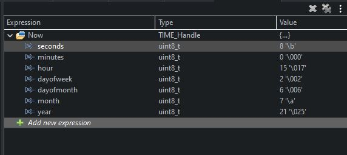
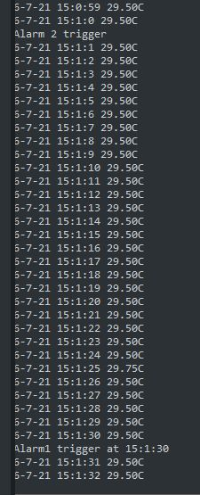

<h1>ZS-042 RTC EEPROM Module</h1>

STM32 I2C HAL & LL library for the DS3231 RTC and AT24C32 EEPROM

Tested on STM32H750 with Alarm1 & Alarm2

EEPROM store Alarm1 setting and retrived when alarm 1 trigger

Comment/Suggestion are highly welcome!
